# VLM 기반 깊이 모델의 약점 — DepthLM-12B · DepthVLM-4B

두 VLM이 모두 학습하지 않은 세 데이터셋(iBims-1, NYUv2, DIODE Outdoor)에서, 같은 데이터를 보지 않은 pure vision 모델 4종(UniDepthV2-L, Metric3Dv2-L, Depth Pro, DAv2-metric-L)과 비교해 약점을 찾았다. 결정 경위와 실행 기록은 [NOTES.md](../NOTES.md)의 D-20·F-16·F-17·F-18, 평가 규칙은 [PROTOCOL.md](PROTOCOL.md) 10절에 있다.

## 요약

두 VLM은 장면 전체의 크기(배율)는 잘 맞히지만, 장면 안의 기하를 연속적으로 그리지 못한다. 공통 약점은 넷이다.

| 공통 약점 | DepthLM | DepthVLM | pure vision 4종 | 어디서 유의한가 |
|:--|--:|--:|--:|:--|
| 깊이 차 10–25 %인 두 곳의 앞뒤를 거꾸로 답함 (iBims-1) | 15.4 % | 11.8 % | 1.6–2.3 % | 세 데이터셋 모두 |
| 평면의 평탄도 오차 ε_plan (iBims-1 평면 126개, 공통 점) | 2.87 cm | 5.05 cm | 0.33–0.59 cm | iBims-1 평면, NYUv2 벽 |
| 원거리의 배율 뺀 오차 (iBims-1 4 m 이상, pure vision 중앙값 대비) | 3.45배 | 1.59배 | 1 | 세 데이터셋 모두 (NYUv2는 원측정 GT로) |
| 학습 밖 실외의 깊은 장면 배율 (DIODE 깊은 1/3) | 0.56배 | 0.72배 | Metric3Dv2 1.03배 | DIODE |

모델마다 따로 있는 약점도 있다.

- **DepthVLM**: 경계가 15 px에 걸쳐 번지고(pure vision 4–5 px), 예측 맵에 32 px 토큰 간격의 격자 무늬가 생긴다. Kinect로 찍은 실내(NYUv2)에서는 5 m부터 먼 곳을 급격히 짧게 본다(9.75 m에서 0.38배).
- **DepthLM**: 같은 숫자를 여러 점에 재사용해 깊이가 계단 모양이 된다.

평가에서 바로잡은 것과 정한 것:

1. **NYUv2 벤치 GT가 8.19 m 이상에서 망가져 있다.** 정답 png 형식으로는 8.19 m까지만 적을 수 있고, 그보다 먼 곳에는 실제보다 훨씬 작은 값이 채워져 있다. 그래서 먼 곳을 짧게 보는 DepthVLM이 NYUv2에서 1위로 보였다. Kinect 원측정으로 다시 채점하면 DepthVLM의 RMSE는 1위(0.453)에서 5위(0.476)로 내려간다. 다만 Metric3Dv2를 뺀 pure vision 3종과의 차이는 통계적으로 없고(+0.004–0.021 m, 95 % CI가 0을 포함), 원거리(4 m 이상)에서는 4종 모두보다 유의하게 나쁘다.
2. **모든 모델은 각 논문의 공식 추론 설정 그대로 비교한다.** GT 초점거리는 그 입력을 받도록 설계된 모델(두 VLM, Metric3Dv2)에만 준다. UniDepthV2+K·Depth Pro+f는 참고용 부록 조건이고 주 비교에 쓰지 않는다(NOTES D-22).

## 1. 무엇을 어떻게 쟀나

- **데이터셋**
  - iBims-1 100장: 레이저, 조밀하고 날카로운 GT.
  - NYUv2 654장: Kinect. 벤치 GT는 SUN RGB-D `depth_bfx`(채운 깊이). 원측정 GT로도 따로 채점했다(2.1절).
  - DIODE Outdoor 446장: 레이저. 식생·유리에서 GT 잡음이 있다.
  - DDAD·nuScenes는 두 VLM의 학습 데이터라 뺐다.
- **두 단위로 비교했다.**
  - 공통 점: Track A의 공통 점(세트마다 약 9,700점). 6개 모델 모두 같은 점에서 비교한다. DepthLM은 점 질의만 가능하다.
  - 전체 픽셀: valid GT 전체. DepthLM을 뺀 5개 모델을 비교한다.
- **예측 맵**: 로컬 GPU에서 Track B와 같은 코드로 다시 추론해 저장했다(`eval/dense_full.py --save_maps`). 전체 지표는 H200 Track B 표와 반올림 자리까지 같다. 공통 점에서 읽은 pure vision 값은 H200 Track A 값과 ±0.3 % 안에서 같다.
- **경우 나누기**: 거리(실내 0–2/2–4/4 m–, 실외 0–10/10–30/30 m–), 경계 3 px(iBims-1 공식 경계, NYUv2 GT 깊이 비 > 1.1; DIODE는 GT 잡음으로 제외), 물체 대분류(NYUv2는 GT 라벨, iBims-1·DIODE는 Mask2Former ADE20K 분할), 물체 크기, 질감, 화면 위치, iBims-1 공식 평면, NYUv2 실측/채움.
- **지표**
  - AbsRel·δ1·RMSE: Track B와 같다.
  - 모양: 이미지마다 배율(평균 log 오차)을 뺀 뒤 남는 log 오차의 rms를 %로 나타낸 것. SILog(λ = 1)를 경우별로 나눈 것이다.
  - 압축 기울기 a: 이미지마다 ln 예측 = a·ln GT + b를 맞춘 값. 1이면 거리 차를 그대로 살린 것이고, 작을수록 먼 곳을 가깝게·가까운 곳을 멀게 눌러 담는다.
  - iBims-1 공식 구조 지표(Koch et al. 2018 식 1–4): DBE와 평면성.
- **판정 기준**: VLM ÷ pure vision 4종 중앙값.
- **신뢰구간**: 이미지 단위 bootstrap 95 % CI(B = 1,000, seed 0, 모든 모델이 같은 재표본).

재현:

```bash
bash prep/weak_maps.sh                            # 7 조건 예측 맵 (로컬 GPU, 약 30 분)
~/venv/main/bin/python prep/semseg_ade.py --datasets ibims1 diode_outdoor nyuv2 --data_root ~/data/depthvlm_bench --out ~/data/vdr_maps/seg
cd eval
~/venv/main/bin/python weak_stats.py              # 이미지 × 모델 × 경우 통계, 공통 점, iBims-1 구조 지표, 경계 단면
~/venv/main/bin/python weak_tables.py             # 경우별 표·비·히트맵·점 쌍
~/venv/main/bin/python weak_nyu_raw.py            # NYUv2 원측정 GT 재채점
~/venv/main/bin/python weak_tables_nyuraw.py      # 원측정 GT 판 표
~/venv/main/bin/python weak_figs.py cards         # 모든 이미지 카드 1,200장
~/venv/main/bin/python weak_figs.py cases         # 경우별 갤러리
~/venv/main/bin/python weak_grid.py               # 토큰 격자 스펙트럼
~/venv/main/bin/python weak_relief.py             # 벽에 붙은 물체
~/venv/main/bin/python weak_nyu_measured.py       # NYUv2 실측 픽셀만 (벤치 GT 값)
~/venv/main/bin/python weak_nyu_follow.py         # 원거리에서 원측정·벤치 GT 중 어느 쪽을 따르나
~/venv/main/bin/python weak_nyu_curve.py          # 깊이별 예측 비율 (NYUv2 원측정·iBims-1)
~/venv/main/bin/python weak_ci.py                 # 공통 약점 CI
~/venv/main/bin/python weak_examples.py           # 약점별 예시 그림 E1–E8
```

## 2. 평가 프로토콜 점검

두 논문(DepthLM, DepthVLM)과 공식 코드, pure vision 4종의 공식 저장소와 대조했다. 대부분 맞았고, 하나는 결론을 바꾼다(2.1).

| 항목 | 확인 내용 | 판정 |
|:--|:--|:--|
| 지표 식 | δ1은 두 공식 코드와 같이 max(p/g, g/p) < 1.25 엄격 부등호다. 두 논문은 δ1만 보고해서 RMSE·AbsRel은 외부 수치와 비교할 수 없다 | 일치 |
| GT 마스크·cap | iBims-1 mask_invalid·mask_transp·0.005–25 m, NYUv2 0.005–10 m가 벤치 `sample_points.py`와 같다 | 일치 |
| DepthVLM 추론 | canonical 크기(가로·세로 모두 fx 기준)가 벤치 2,754장 모두와 같다. 프롬프트·프로세서·bf16·출력(Softplus, 초점 재스케일 없음)이 공식과 같다 | 일치 |
| DepthLM 추론 | 초점 750, 5 px 화살표, 테두리 점 제외, 질문 문장, greedy, 답 파싱이 공식과 같다 | 일치 |
| pure vision 4종 추론 | 입력 크기·정규화·정밀도·TTA 없음·상한이 각 공식 함수의 기본값과 같다. 논문 수치와 비교할 수 있는 칸(iBims-1 UniDepthV2·Metric3Dv2, DIODE Metric3Dv2)은 프로토콜 차이 안에서 재현된다 | 일치 |
| 공통 점 샘플링 | valid 픽셀에서 균일 비복원 추출이고 경계 제외가 없다. 경계 점 비율이 픽셀 비율과 같다(iBims-1 4.7 % 대 4.4 %) | 편향 없음 |
| DepthVLM 출력 정의 | 학습 라벨 일부(Argoverse2·Waymo)는 유클리드지만, 광선 계수 구간별 예측/GT가 iBims-1·NYUv2에서 평평해 유클리드 징후가 없다 | 영향 없음 |
| **NYUv2 벤치 GT** | 8.19 m 이상을 표현하지 못하고 더 작은 값이 채워져 있다. 2.1절 | **결론 바뀜** |
| GT 초점거리 비대칭 | 두 VLM과 Metric3Dv2는 GT 초점거리를 쓰고, UniDepthV2·Depth Pro·DAv2는 쓰지 않는다(각 공식 설정). 부록 실험: UniDepthV2+K는 iBims-1 AbsRel 0.090 → 0.077, Depth Pro+f는 NYUv2 배율 치우침 +9.2 % → +0.9 %. 모양 오차는 거의 그대로다(iBims-1 UniDepthV2 7.0 → 7.2 %) | 공식 설정 그대로 (부록 조건은 참고용) |
| 예측을 자르지 않음 | Depth Pro는 0.08 % 픽셀에서 10⁴ m까지 내놓아 실외 RMSE를 지배한다(DIODE를 80 m로 자르면 88.8 → 9.25 m). AbsRel·δ1·모양 오차에는 영향이 작다 | RMSE 순위만 영향 |
| DIODE GT 잡음 | 식생·유리·스캔 줄무늬(GT 스펙트럼 0.18 /px의 봉우리). 모든 모델에 같이 작용한다. 경계 분석은 제외 | 모든 모델 공통 |
| 문서 | 결과 표는 B = 1,000으로 만들었는데 PROTOCOL에는 2,000으로 적혀 있었다. UniDepthV2 '카메라 없음' 경로를 `scripts/demo.py`라고 적었는데, demo는 GT K를 넣고 카메라 없는 경로는 README 예시다 → 둘 다 고침 | 고침 (결과 영향 없음) |

### 2.1 NYUv2 벤치 GT가 8.19 m 이상에서 망가져 있다

- DepthVLM-Bench의 NYUv2 GT는 SUN RGB-D `depth_bfx` png ÷ 8,000이다. 16비트 png의 최댓값은 65,535 ÷ 8,000 = 8.19 m라서 그보다 먼 값은 그대로 적을 수 없다. 실제 파일에는 그 자리에 더 작은 값이 들어 있다. 단순 넘침(65,536 나머지)으로 맞는 픽셀은 4 %뿐이라, SUN RGB-D가 빈 곳을 채우는 과정에서 생긴 것으로 보인다. 원본 처리 코드가 없어 정확한 경위는 모른다.
- 654장 GT의 최댓값은 7.995 m다. Kinect 원측정(`nyu_depth_v2_labeled.mat` rawDepths)이 8–10 m인 픽셀(실측의 0.37 %, 108장)에서 벤치 GT는 4.6 m, 원측정은 8.8 m다(이미지별 중앙값의 픽셀 수 가중 평균).
- 이 픽셀은 대부분 실제 먼 표면이다: 라벨 없음 47 %, 벽 19 %, 문 5 %, 액자 4 %. 창문은 3 %, 거울은 0.1 %다(F-18 수정 전, 10.0 m 포화값을 포함한 집계).
- 예측을 보면 pure vision 4종은 원측정 쪽(8.6–9.0 m)이고, DepthVLM만 벤치 GT 쪽(4.6 m)이다. 벤치 GT가 원측정의 절반도 안 되는 픽셀(49장)에서 DepthVLM은 69 %가 벤치 GT에 더 가깝다(pure vision 3 %).
- 이것이 손상 GT를 배운 결과인지는 확정할 수 없다. 공개 학습 설정에는 NYUv2·SUN RGB-D가 없다. DepthVLM은 GT 결함이 시작되는 8.19 m보다 앞인 5–6 m부터 서서히 꺾인다(E10). Kinect 실내 사진에서 먼 곳을 짧게 보는 약점이, 하필 같은 방향의 GT 결함과 겹친 것으로 보는 편이 자연스럽다. DepthLM은 이 픽셀에서 무너지지 않는다(공통 점 29개, 원측정 대비 0.74배 — NYUv2 전체 0.84배와 비슷하다).

Kinect 원측정 GT(실측 픽셀만, 0.005 m ≤ GT < 10 m)로 같은 예측을 다시 채점한 결과. 원측정에서 정확히 10.0 m인 픽셀 19.6만 개는 센서 상한에서 잘린 포화값이라 뺐다([9.999, 10) 구간에는 35개뿐, BTS 표준 평가도 GT < 10 m). 처음 재채점(F-17)은 이 값을 정답 10 m로 넣어 DepthVLM RMSE를 0.547로 부풀렸다(NOTES F-18):

| 전체 픽셀 | RMSE: 벤치 GT | RMSE: 원측정 GT | SILog: 벤치 GT | SILog: 원측정 GT | AbsRel: 원측정 GT | δ1: 원측정 GT |
|:--|--:|--:|--:|--:|--:|--:|
| DepthVLM | **0.453 (1위)** | **0.476 (5위)** [0.436, 0.516] | 13.1 (1위) | 10.9 (4위) | 0.081 (2위) | 0.943 (2위) |
| Metric3Dv2 | 0.877 | 0.339 [0.305, 0.386] | 18.4 | 11.4* | 0.069 | 0.967 |
| UniDepthV2 | 0.970 | 0.459 [0.432, 0.488] | 13.9 | 7.9 | 0.124 | 0.901 |
| Depth Pro | 0.943 | 0.454 [0.426, 0.484] | 14.0 | 7.9 | 0.122 | 0.890 |
| DAv2 | 0.903 | 0.472 [0.445, 0.500] | 14.9 | 8.6 | 0.121 | 0.891 |

\* Metric3Dv2는 NYUv2 픽셀의 0.18 %(516장, 주로 아래·오른쪽 테두리 10 px)에 0.1 m 미만을 내서 log 지표가 커진다. 공식 hub 경로를 그대로 쓴 출력이다(NOTES F-19). 이 픽셀을 빼면 SILog는 약 7.8이다.

공통 점(원측정이 있는 8,483점)에서도 DepthVLM RMSE는 0.364(6개 중 1위)에서 0.489(5위)로 내려간다. DepthLM은 0.656 → 0.623(6위)이다.

결론: Track A·B의 NYUv2 행, 특히 RMSE와 SILog는 벤치 GT 결함의 영향을 받는다. 이 문서의 NYUv2 약점 분석은 원측정 GT 판을 기준으로 한다. 주 결과 표를 원측정 GT로 바꿀지는 아직 정하지 않았다(NOTES F-17).

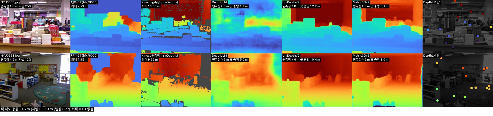

## 3. 두 VLM의 공통 약점

### 3.1 깊이 차가 작은 두 곳의 앞뒤를 틀린다

같은 이미지의 공통 점 쌍 가운데, GT 깊이 차가 10–25 %인 쌍에서 앞뒤를 거꾸로 답한 비율이다.

| 세트 | DepthLM | DepthVLM | pure vision | VLM − pure vision 중앙값 (95 % CI) |
|:--|--:|--:|--:|:--|
| iBims-1 | 15.4 % | 11.8 % | 1.6–2.3 % | DepthLM +13.5 %p [11.1, 16.3] · DepthVLM +9.9 %p [8.2, 11.6] |
| NYUv2 (원측정 GT) | 8.5 % | 9.4 % | 2.2–3.6 % | +5.7 %p [4.7, 6.7] · +6.6 %p [5.7, 7.5] |
| DIODE | 27.0 % | 24.4 % | 12.1–19.2 % | +10.6 %p [9.1, 12.2] · +8.0 %p [6.8, 9.0] |

- 깊이 차가 2배를 넘으면 DepthVLM은 pure vision과 비슷해진다(iBims-1 0.4 %). 큰 앞뒤 관계는 알지만 세밀한 차이를 놓친다.
- 두 점의 깊이 비율 오차도 점 사이 거리와 상관없이 pure vision의 3–6배다. iBims-1에서 50 px 안의 쌍은 DepthLM 2.4 %, DepthVLM 3.3 %, pure vision 0.5–0.6 %다.
- 예시(corridor_01): 천장 배관 A(4.08 m)와 왼쪽 벽 위 B(3.55 m). 두 VLM은 A가 가깝다고 답하고, pure vision 4종은 모두 B라고 맞힌다.

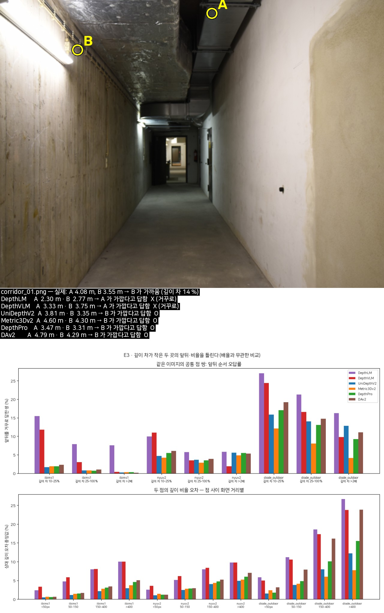

### 3.2 평면을 평평하게 그리지 못한다

iBims-1 공식 평면(바닥·벽·책상)에서, 이미지 배율을 GT에 맞춘 뒤 평면을 3D로 맞춰 쟀다.

| 단위 | 지표 | DepthLM | DepthVLM | pure vision |
|:--|:--|--:|--:|--:|
| 공통 점 (평면 126개, 평면당 중앙 15점) | ε_plan 중앙값 | 2.87 cm | 5.05 cm | 0.33–0.59 cm |
| | ε_orie 중앙값 | 6.4° | 9.1° | 1.5–2.3° |
| | pure vision 대비 (95 % CI) | 6.6배 [5.3, 7.9] | 10.7배 [9.6, 12.3] | 1 |
| 전체 픽셀 (평면 244개) | ε_plan 평균 | – | 6.53 cm | 0.50–1.37 cm |
| | ε_orie 평균 | – | 13.1° | 1.9–2.8° |

- 벽이 가장 나쁘다. DepthVLM 벽 평면은 평균 9.4 cm·17.4° 어긋난다. NYUv2(원측정 GT, 공통 점)에서도 벽의 모양 오차는 pure vision의 1.80배(DepthLM)·2.00배(DepthVLM)다.
- 예시(kitchen_07, 벽이 이미지의 52 %): 벽 한 줄을 따라가면 DepthVLM 오차가 −4 %에서 +21 %로, DepthLM 점도 −10 %에서 +20 %로 같은 방향으로 기운다. 두 VLM이 벽의 방향을 똑같이 틀린다. pure vision은 0 근처에서 평평하다.
- 벽에 붙은 평평한 물체(액자·칠판·포스터·화이트보드·모니터)도 벽과 같은 면으로 그리지 못한다.
  - 물체와 둘레 벽의 오차 차이 크기는 공통 점에서 DepthLM 5.1 %, DepthVLM 6.6 %, pure vision 1.1–2.1 %다(iBims-1, 35장).
  - NYUv2 원측정 GT(공통 점)의 모양 오차 비는 2.09·1.88이다.
  - 방향은 일정하지 않다. 칠판을 튀어나오게 보는 사례(lectureroom_09)도, 들어가게 보는 사례도 있다.

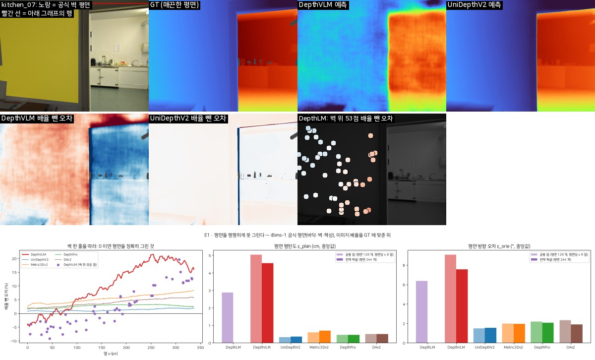

### 3.3 원거리와 거리 압축

이미지 배율을 뺀 뒤에도 가까운 곳은 멀게, 먼 곳은 가깝게 본다.

| 세트 | 압축 기울기 a: DepthLM | DepthVLM | pure vision | 원거리 모양 오차 비 (95 % CI): DepthLM | DepthVLM |
|:--|--:|--:|--:|:--|:--|
| iBims-1 | 0.80 | 0.90 | 0.95–0.99 | 3.45 [2.39, 4.66] | 1.59 [1.41, 1.84] |
| NYUv2 (원측정 GT) | – | – | – | 1.42 [1.22, 1.69] | 1.85 [1.49, 2.35] |
| DIODE | 0.60 | 0.64 | 0.69–0.87 | 1.65 [1.51, 1.84] | 1.16 [1.08, 1.25] |

- 기울기 차의 CI는 iBims-1에서 DepthLM −0.17 [−0.21, −0.11], DepthVLM −0.07 [−0.10, −0.04]이다. DIODE에서는 −0.14 [−0.18, −0.11], −0.09 [−0.13, −0.07]이다.
- NYUv2는 원측정 GT로도 기울기 차가 0을 포함한다. 점 대부분이 4 m 안에 있어서, 소수의 먼 점에 몰린 DepthVLM의 붕괴가 기울기에 거의 드러나지 않는다.
- 실제 깊이별 예측/실제 중앙값(E10)
  - NYUv2 원측정: DepthVLM은 5.25 m에서 0.96, 7.75 m에서 0.67, 9.25 m에서 0.52, 9.75 m에서 0.38로 떨어진다. pure vision은 0.95–1.08이다. (처음 그림의 10.25 m 구간은 10.0 m 포화값만 모인 칸이라 뺐다, F-18)
  - iBims-1 레이저: DepthVLM은 12 m까지 0.80 이상이다.
  - Kinect 실내 사진에서 유독 심하다.
- δ1로 봐도 원거리는 DepthVLM이 배율 강점을 갖고도 pure vision보다 나쁘다(오답률 비 iBims-1 1.24, DIODE 1.38).
- 예시(restaurant_10): 기울기 DepthLM 0.56, DepthVLM 0.65, Metric3Dv2 1.01.

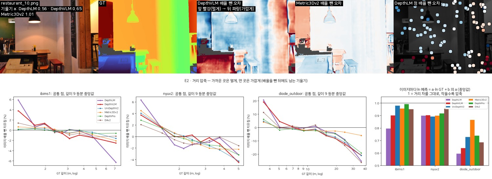
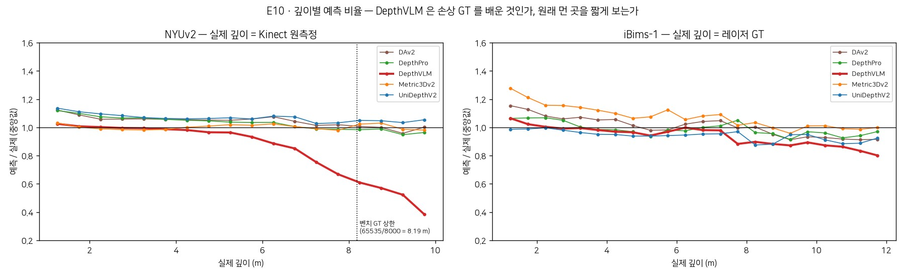

### 3.4 학습 밖 실외의 깊은 장면에서 배율이 무너진다

DIODE Outdoor에서 이미지 배율을 장면 중앙 깊이에 맞춰 본 기울기다.

| | DepthLM | DepthVLM | Metric3Dv2 | UniDepthV2 | Depth Pro | DAv2 |
|:--|--:|--:|--:|--:|--:|--:|
| 기울기 (0 = 깊이와 무관) | −0.41 | −0.25 | +0.01 | +0.31 | −0.25 | −0.49 |
| 깊은 1/3 장면(중앙 깊이 16–58 m) 배율 중앙값 | 0.56 | 0.72 | 1.03 | 1.94 | 0.57 | 0.90 |

- 같은 GT 초점거리를 받는 Metric3Dv2는 깊이와 무관하게 배율을 지키는데, 두 VLM은 초점거리를 받고도 깊은 장면을 가깝게 본다.
- Depth Pro·DAv2도 같은 방향이라 VLM만의 약점은 아니다.
- 예시(00023_00199_outdoor_230_030, 건물 벽 24 m): DepthLM 0.24배, DepthVLM 0.31배, Metric3Dv2 1.00배.

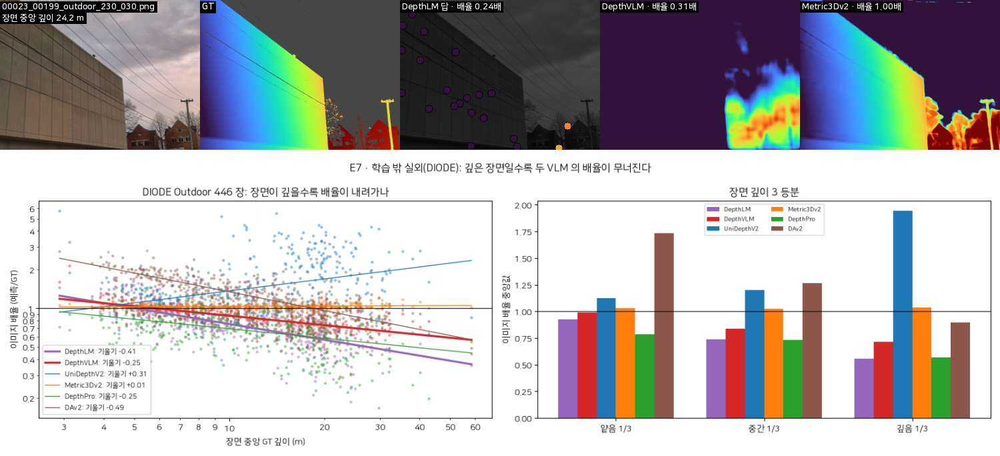

### 3.5 이미지 단위로 보면

공통 점 8개 이상인 이미지에서, 두 VLM이 모두 pure vision 4종 **전부**보다 모양 오차가 큰 이미지 비율은 iBims-1 87 %, NYUv2(벤치 GT) 34 %, DIODE 29 %다. pure vision 중앙값보다 큰 비율은 96 %, 60 %, 66 %다.

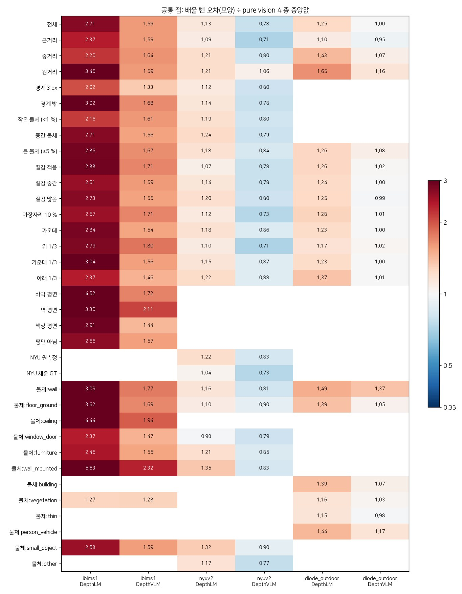
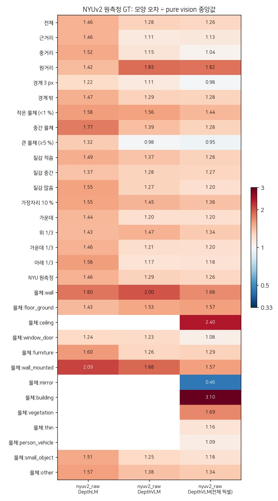

## 4. 모델별 약점

### 4.1 DepthVLM: 경계 흐림과 토큰 격자

| iBims-1 | DepthVLM | pure vision | GT (같은 절차 자기 점검) |
|:--|--:|--:|--:|
| 깊이 계단 10→90 % 폭 | 15.0 px | 4.2–5.1 px | 1.8 px |
| ±12 px 안에서 회복한 계단 비율 | 65 % | 91–95 % | 100 % |
| DBE ε_comp (GT 경계 → 예측 경계) | 7.63 px | 2.08–3.24 px | 1.08 px |
| DBE ε_acc | 2.97 px | 1.65–2.22 px | 1.08 px |
| 예측 깊이에서 잡힌 경계 픽셀 | 678 | 2,875–3,543 | 4,293 |

- DBE의 Canny 문턱을 바꾸거나(0.15/0.3) log 깊이로 정규화해도 순서는 같다.
- 경계가 번지는 폭이 넓어서 얇은 구조(의자 다리, 창틀, 나뭇가지)가 사라진다. DIODE의 나무 사이로 먼 건물이 보이는 장면에서 오차가 100 %를 넘는다.
- 그런데 pure vision 대비 비율로 보면 경계(1.33배)보다 매끈한 면 안쪽(1.68배)이 더 나쁘다. pure vision도 경계에서는 틀리지만 면 안쪽은 거의 완벽하기 때문이다. 그래서 DepthVLM의 가장 큰 약점은 경계보다 면이다(3.2).
- **토큰 격자**: DepthVLM 깊이 헤드는 32 px 토큰을 kernel = stride인 전치 합성곱(8·4·2)으로 키운다(`third_party/DepthVLM/model/dpt_depth_head.py:65–85`).
  - 예측 맵의 행 방향 스펙트럼에서 토큰 주기(GT 해상도 iBims-1 17.3 px, NYUv2 16.5 px, DIODE 28.4 px)에 주변의 2.1–2.5배인 봉우리가 있다. GT와 pure vision은 1.0–1.3배다.
  - 평평한 벽의 고주파 성분을 보면 블록 무늬로 나타난다.

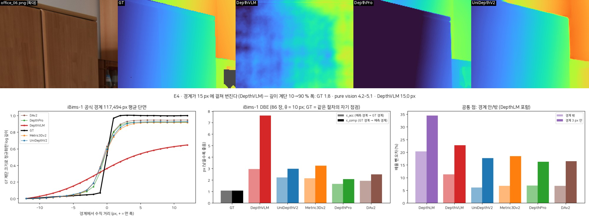
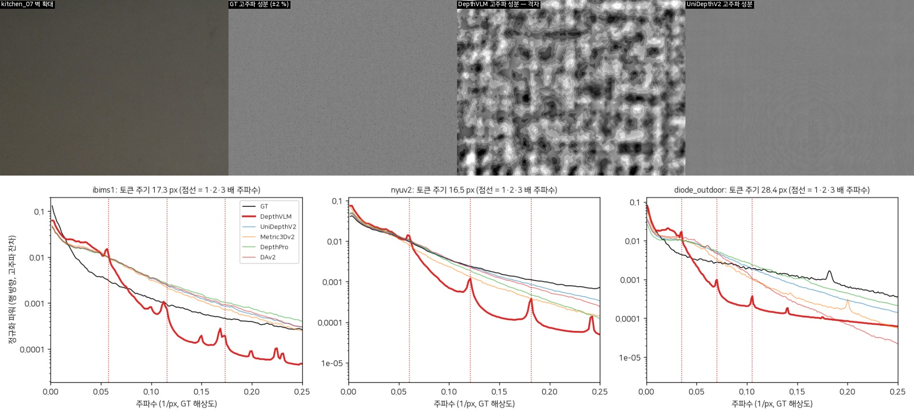

### 4.2 DepthLM: 답 재사용 계단

- 깊이를 숫자 텍스트로 답하면서 같은 값을 여러 점에 다시 쓴다. corridor_01에서 99점에 서로 다른 답은 56개다(DepthVLM 90, UniDepthV2 88). iBims-1 전체로는 이미지당 98점에 36개였다(F-14).
- 매끈한 벽에서도 깊이가 계단 모양이 되고, 계단 사이에서 튄다. 점마다 흩어짐이 커서 iBims-1 모양 오차가 20.5 %다(pure vision 7.0–7.6 %).

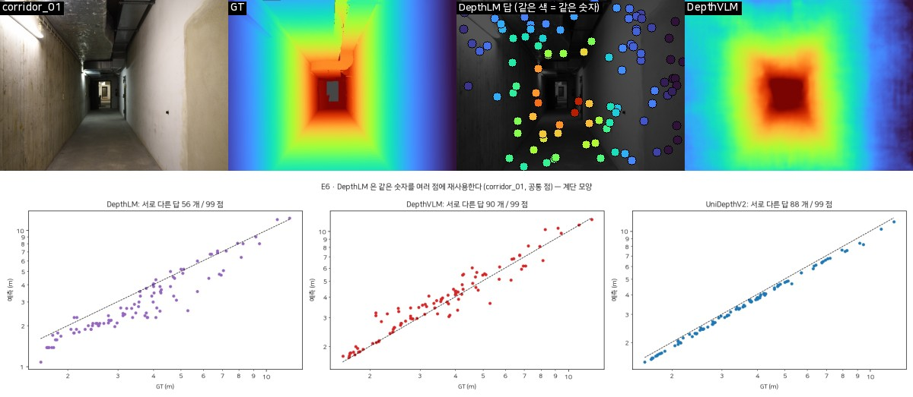

## 5. 약점이 아니거나 해석에 주의할 것

- **NYUv2에서 DepthVLM이 좋아 보이는 것**은 벤치 GT 때문이다.
  - 8.19 m 이상이 감긴 값(2.1)과 Kinect가 재지 못해 채운 값(평균 13 %)이 원인이다.
  - 벤치 GT 값으로 실측 픽셀만 채점해도 모양 오차 순위가 1위에서 3위로 내려간다(E8).
  - 원측정 GT로 채점하면 iBims-1과 같은 그림이 된다.

  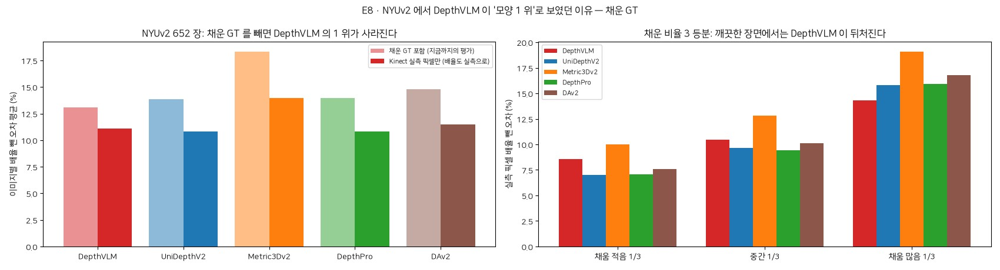
- **경계**: 절대 오차는 모든 모델이 경계에서 크다. VLM이 "경계에서 특히 더 나쁜" 것은 아니다(3.2, 4.1).
- **벽에 붙은 물체**: 튀어나오게 보는 일관된 방향은 없다. 크기로만 크다.
- **DIODE**: 식생·유리의 GT 잡음이 모든 모델의 오차를 키운다. 실외 zero-shot은 이 한 세트(장면 3개)뿐이라, 실외 결론의 일반화에는 한계가 있다.

## 6. 강점 (비교의 균형을 위해)

- **배율**: DepthVLM은 장면 전체의 배율을 잘 맞힌다(iBims-1·NYUv2 배율 치우침: 공통 점 +0.1 %·+0.5 %, 전체 픽셀 +0.0 %·+0.1 %). NYUv2 원측정 GT로도 AbsRel·δ1은 2위다.
- **꼬리가 짧다**: DepthVLM은 크게 망가지는 이미지가 적다(Track B, NOTES F-15).

## 7. 그림 폴더

`results_vlm_weakness/` (git에서 빠짐, 약 0.5 GB)

| 폴더 | 내용 |
|:--|:--|
| `cards/<세트>/` | 모든 이미지 1,200장. 1행 RGB·GT·거리 구간+경계·물체 분류·평면(iBims-1)/채운 GT(NYUv2)/물체 크기(DIODE), 2행 예측, 3행 오차, 4행 배율 뺀 오차. 열 = DepthLM(점)·DepthVLM·pure vision 4종. NYUv2 카드는 벤치 GT 기준이다 |
| `cases/<세트>/<경우>.jpg` | 경우마다 DepthVLM이 pure vision보다 가장 크게 틀린 이미지 6장. 해당 영역을 노랑으로 표시하고, 그 영역의 오차와 DepthLM 점을 함께 보여준다 |
| `examples/` | 약점별 예시 E1–E10, 토큰 격자 스펙트럼 |
| `00_summary/` | 경우 × 세트 × 모델 히트맵 (모양 오차 비, δ1 오답률 비, NYUv2 원측정 판) |
| `*.csv` | 경우별 표(`points_groups.csv`, `dense_groups.csv`, `nyuraw_*`), 비(`*_ratio.csv`), 점 쌍, 이미지별, 압축 기울기, 평면, NYUv2 원거리, CI(`ci_common*.csv`) |
